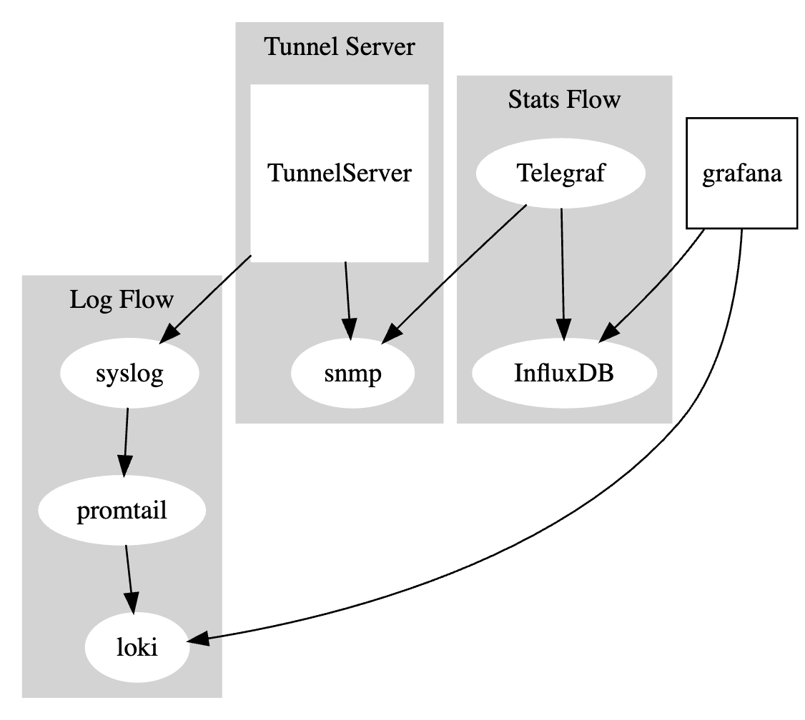

Overview
========

This repo can be used as a recommendation for guidance on setting up tunnel server observability (Logging and Telemetry)

Architecture
============



Pre-reqs
========

* Tunnel configured on UEM Console.Follow the existing steps to configure syslog in UEM Console and enabling snmp(if using UAG).
* Tunnel Server deployed through UAG or container
* All connectivity should be working as expected.


Logging and Telemetry
=====================

Set Up
------

* Deploy Linux VM 
    * Chose distribution of your choice, though Alma Linux is recommended for use. You can also choose to download [here](https://almalinux.org/get-almalinux/)
        * Resource recommendation of Linux VM 4 core 16GB 100 GB storage 
        * Retention policy
            * For Logs, 7 days of data is retained.
    * Ensure, docker and docker-compose is installed on Linux VM. Run `docker version` to confirm the same.
    * Start docker using `systemctl start docker`
* Clone the repo on Linux VM OR download to your local,zip the entire repo and transfer it to VM.
* Login to VM
* Go to directory where repo is cloned or unzip it if zipped.
* open [.env](./.env) file in this directory and fill in the below information
```
TELEGRAF_HOST=<LINUX VM IP>

INFLUXDB_HOST=<LINUX VM IP>
INFLUXDB_PORT=8086
DOCKER_INFLUXDB_INIT_MODE=setup
DOCKER_INFLUXDB_INIT_USERNAME=<INFLUXDB USERNAME>
DOCKER_INFLUXDB_INIT_PASSWORD=<INFLUXDB PASSWORD>
DOCKER_INFLUXDB_INIT_ORG=snmp
DOCKER_INFLUXDB_INIT_BUCKET=metrics
DOCKER_INFLUXDB_INIT_ADMIN_TOKEN=metrics

GRAFANA_PORT=3000
GRAFANA_URL=<LINUX VM IP>
GRAFANA_USER=<GRAFANA USERNAME>
GRAFANA_PASSWORD=<GRAFANA PASSWORD>
GRAFANA_PLUGINS_ENABLED=true
GRAFANA_PLUGINS=grafana-piechart-panel

# Define as "udp://<hostname_or_ip1>:161,udp://<hostname_or_ip2>:161,udp://<hostname_or_ip3>:161"
SNMP_SERVERS=<TUNNEL SERVER IPS IN ABOVE FORMAT>
```
* Run `docker-compose up --build --force-recreate -d`
* Open any browser on your local OR any machine which has connectivity to the Linux VM and type `http://<linux-vm-ip>:3000`
    * You can view the logs and stats here.

Configuration
-------------

* Configure syslog (Linux VM IP or URL/hostname) on UEM Console and save the configuration.
    * This will send access log to server. Assumption is the syslog server runs on port 514.
    * For application (tunnel server) logs, configure kvp settings as well.Starting Tunnel Server version 23.12, use below KVP to redirect tunnel application and reporter logs to syslog.
    * udp port 514 is supported.


* Tunnel Server container already exposes port 161 for snmp stats. In UAG, enable snmp following guide [here](https://docs.vmware.com/en/Unified-Access-Gateway/2303/uag-deploy-config/GUID-F71E6283-E24B-49F5-8AC6-D28915CD41AD.html).
    * Only snmp v2 is supported.

Tests
-----

1. Enroll a device and try accessing any tunnel’ed resource from any enrolled device. 
2. You should start seeing the logs and stats `http://<linux-vm-ip>:3000`


Demo
----
Setup
=======
**Setup**


------------
**Dashboard**


Reference documents
-------------------

* [Syslog Configuration](https://docs.vmware.com/en/VMware-Workspace-ONE-UEM/services/VMware_Tunnel/GUID-471260BA-4DDC-4BFE-B8C3-FA2DDC2116A1.html)
* [SNMP Configuration in UAG](https://docs.vmware.com/en/Unified-Access-Gateway/2303/uag-deploy-config/GUID-F71E6283-E24B-49F5-8AC6-D28915CD41AD.html)
